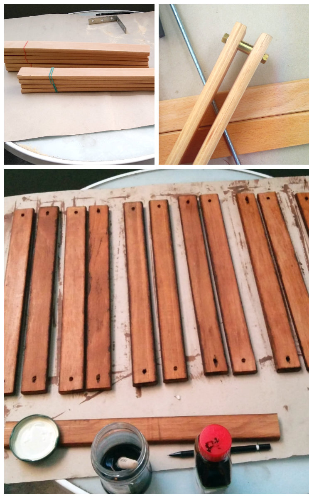

{:class="img-col-12"}{:class="img-col-6 img-clear"}{:class="img-col-6"}{:class="img-col-4 img-clear"}{:class="img-col-4"}{:class="img-col-4"}

------

{:class="img-col-12"}{:class="img-col-6 img-clear"}{:class="img-col-6"}{:class="img-col-12"}{:class="img-col-12"}{:class="img-col-12"}

icosahedron tensegrity movement-responsive light sculpture using recycled materials

the system is controlled by a Pro Trinket connected to a three axis accelerometer.
The light is provided by RGBW LED strips that can control the color and white brightness value individually.
[instructable article](https://www.instructables.com/id/Interactive-Led-Lamp-Tensegrity-Structure-Arduino/)

[arduino + accelerometer + RGBW LED]

