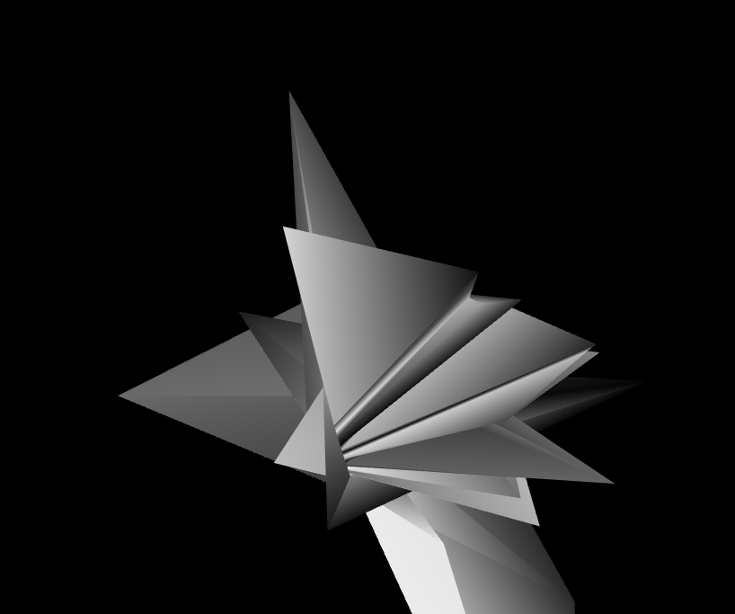
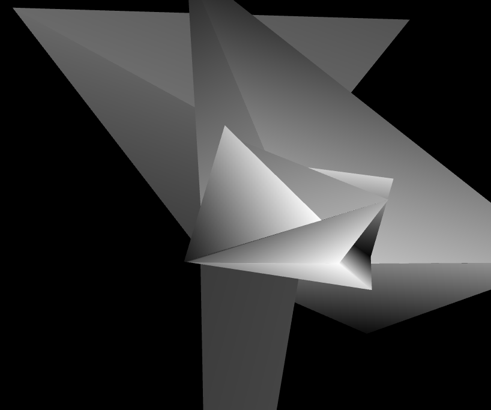
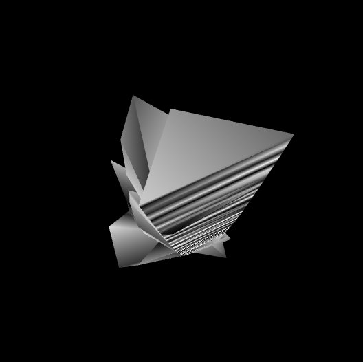
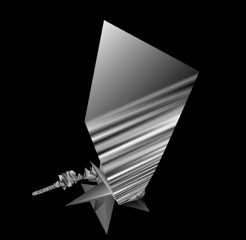
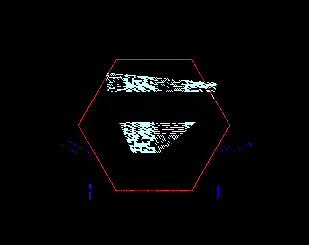
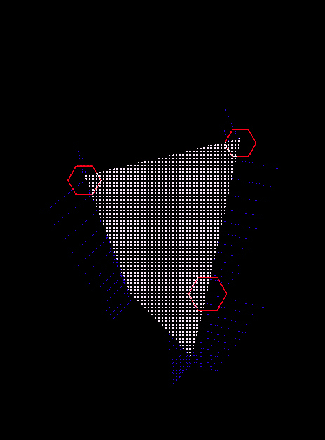

{:class="img-col-12"}{:class="img-col-4 img-clear"}{:class="img-col-4"}{:class="img-col-4"}{:class="img-col-12"}{:class="img-col-12"}

collaborative mesh modeling using people's movement by reading the accelerometer sensor of devices connected to a network.
[code on github](https://github.com/action-script/fluid-shape-socket/)

[nodejs + websockets + webgl]

