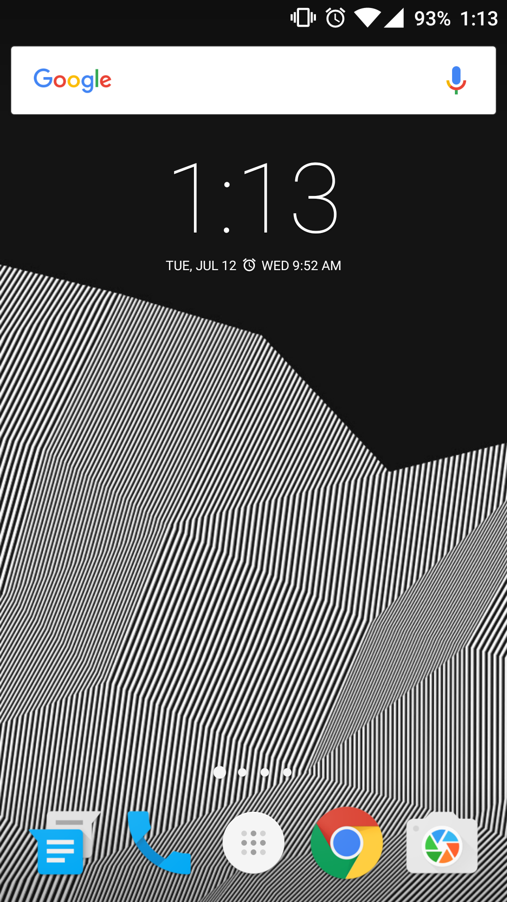{:class="img-col-6"}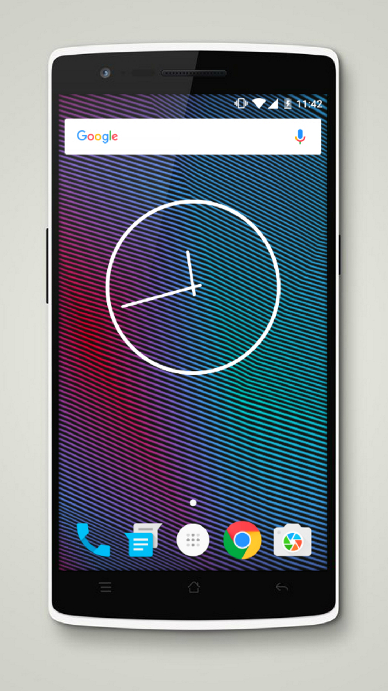{:class="img-col-6"}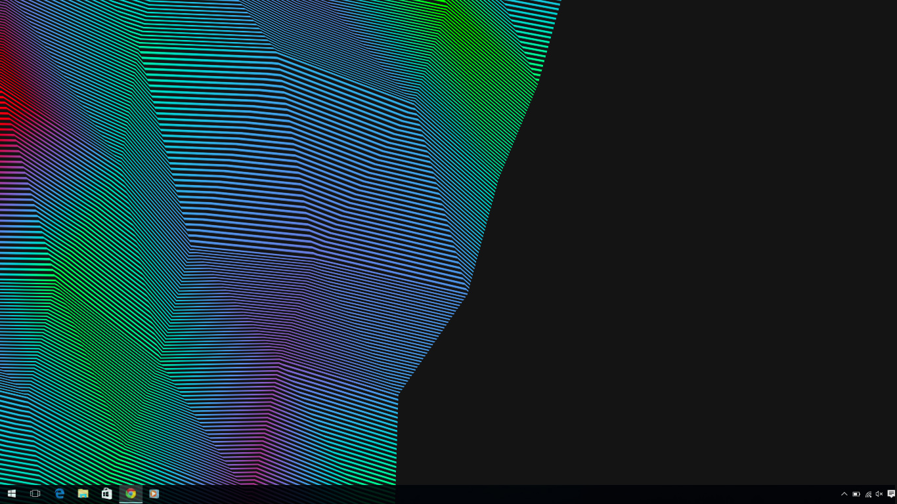{:class="img-col-12 img-clear"}

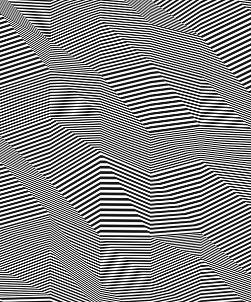{:class="img-col-4"}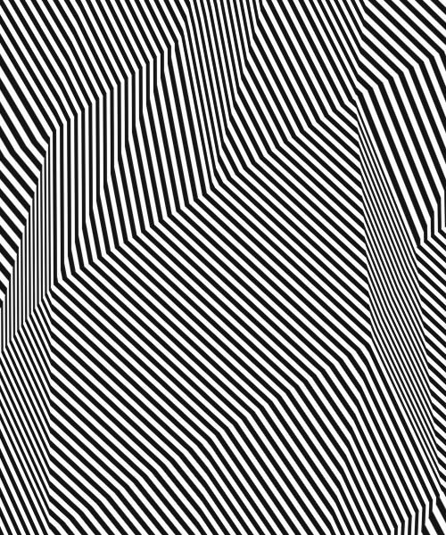{:class="img-col-4"}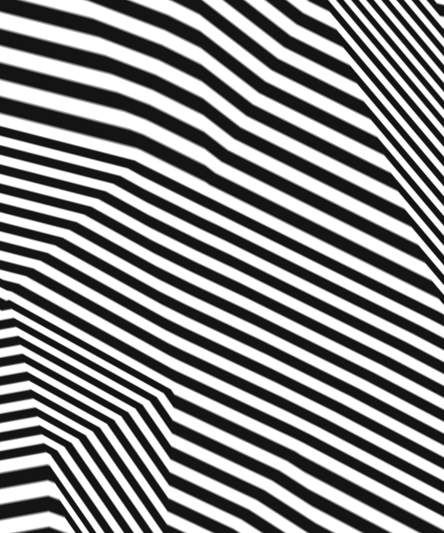{:class="img-col-4"}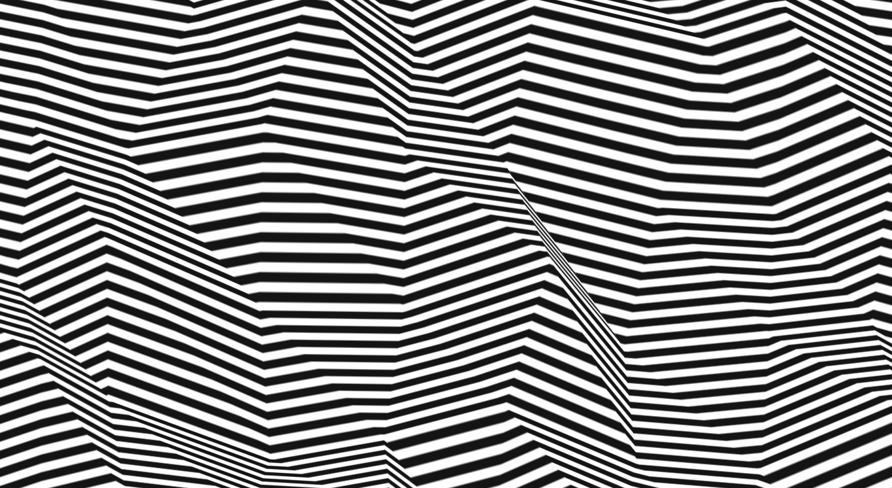{:class="img-col-12 img-clear"}

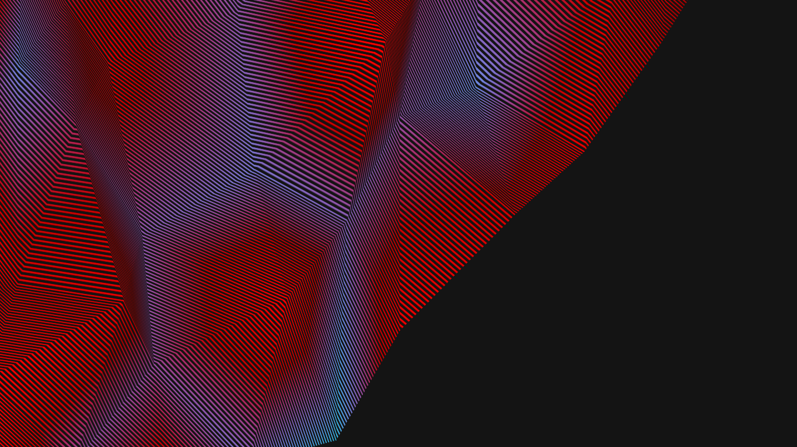{:class="img-col-12"}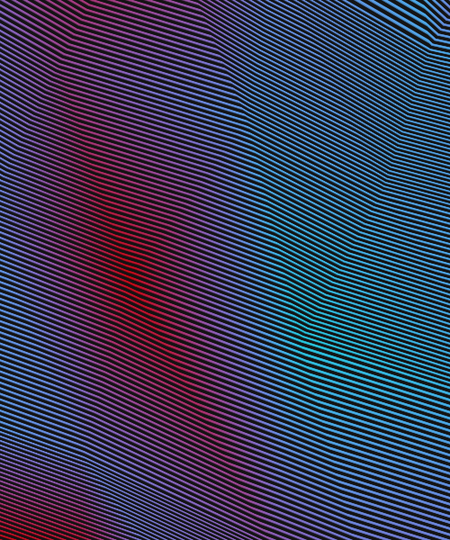{:class="img-col-4 img-clear"}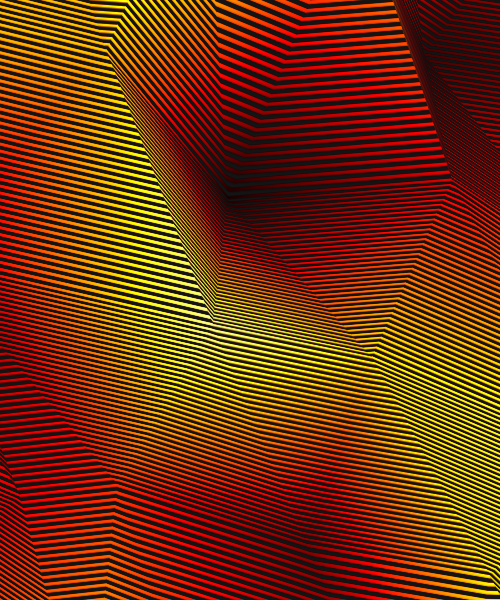{:class="img-col-4"}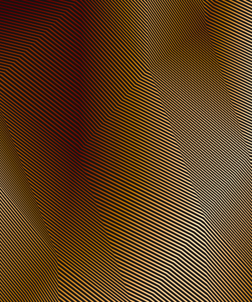{:class="img-col-4"}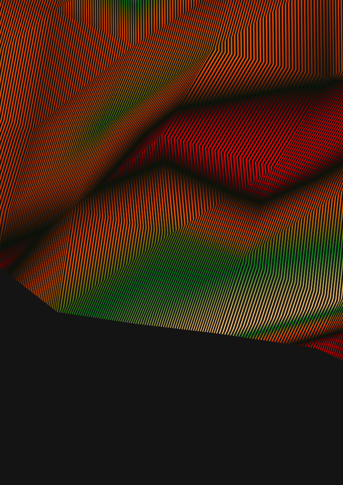{:class="img-col-12 img-clear"}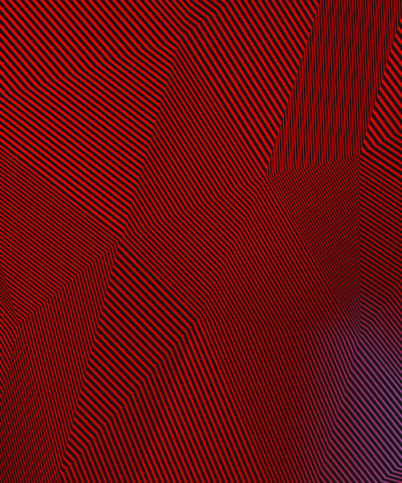{:class="img-col-12 img-clear"}

generative background pattern design by utilizing orthographic projection and color height maps
