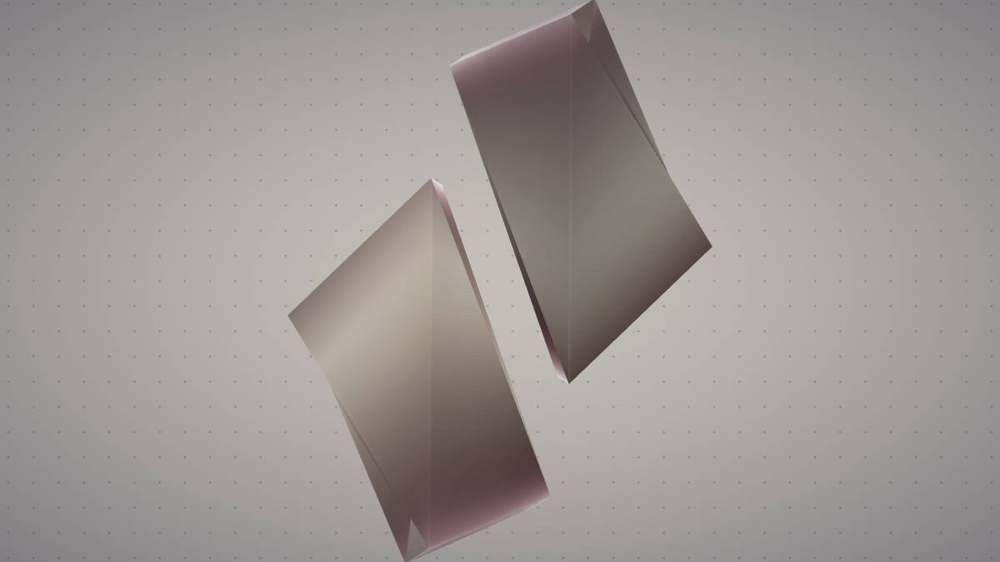
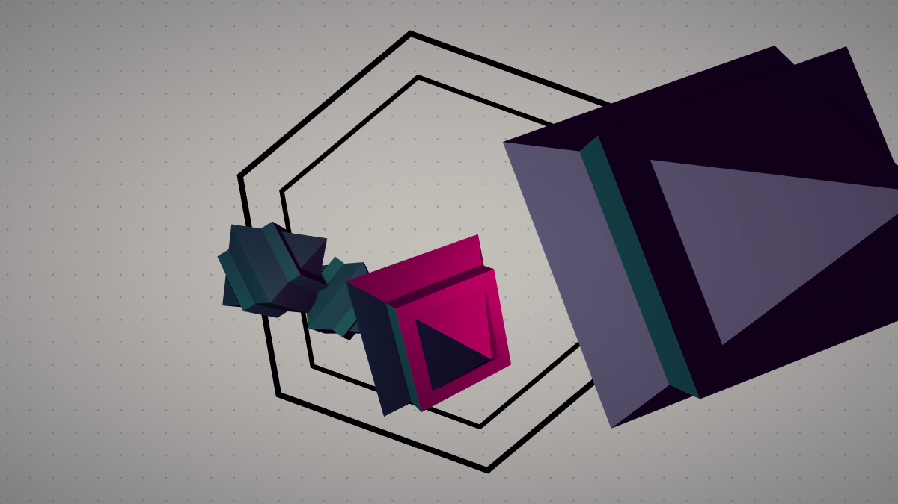
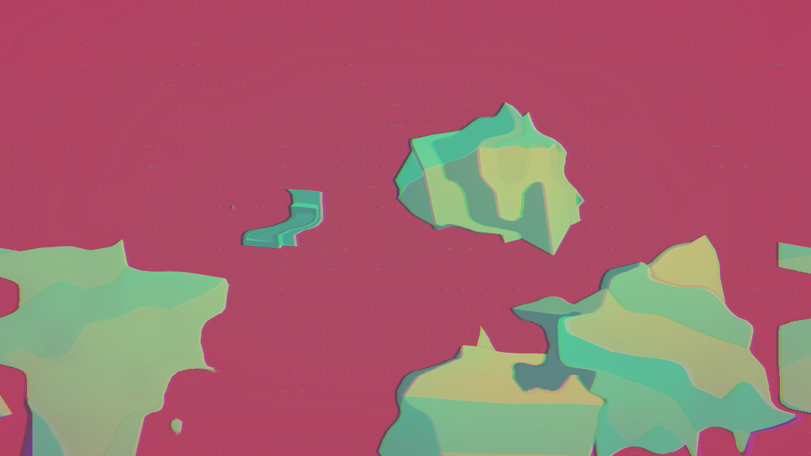
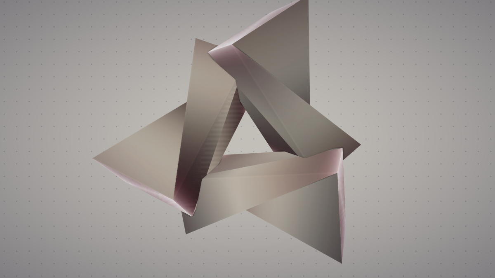
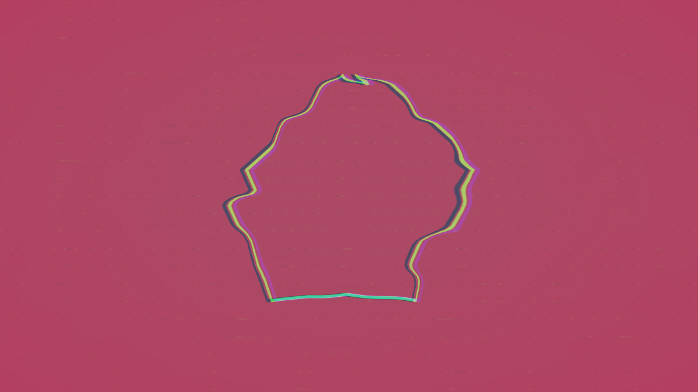
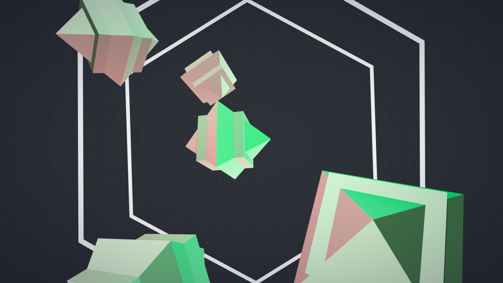
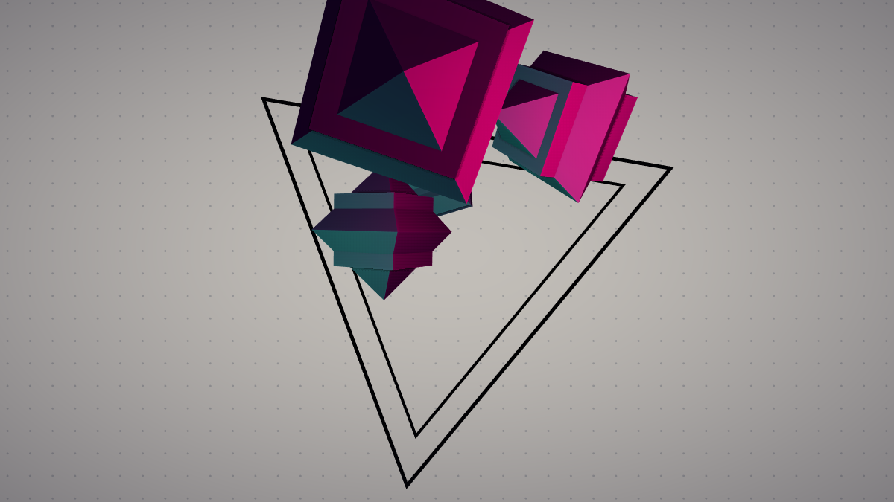
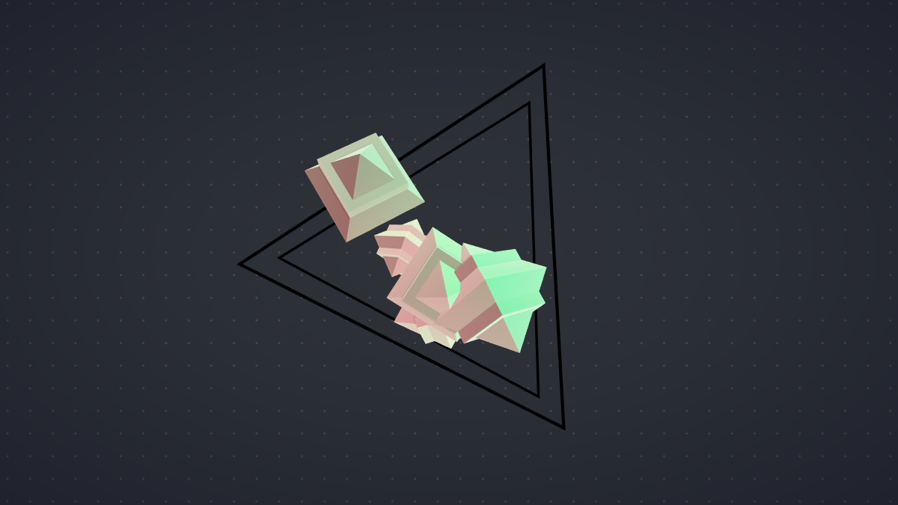
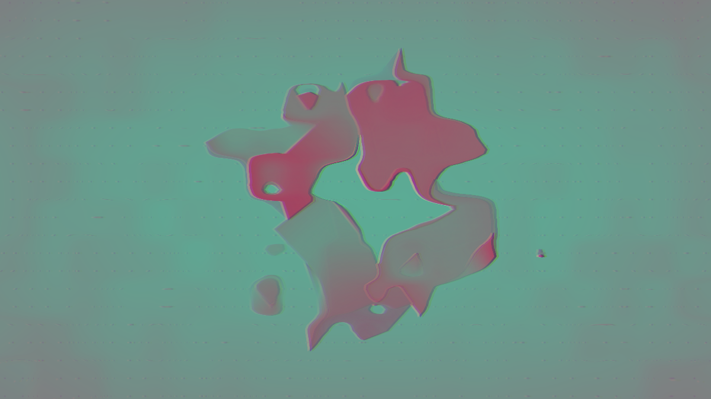

<iframe frameborder="0" src="https://cables.gl/view/5afbd7a75816ec675f8519b7"></iframe>

------

{:class="img-col-6"}{:class="img-col-6"}{:class="img-col-4 img-clear"}{:class="img-col-4"}{:class="img-col-4"}{:class="img-col-12"}{:class="img-col-12"}{:class="img-col-6 img-clear"}{:class="img-col-6"}{:class="img-col-12"}

[cables.gl]

