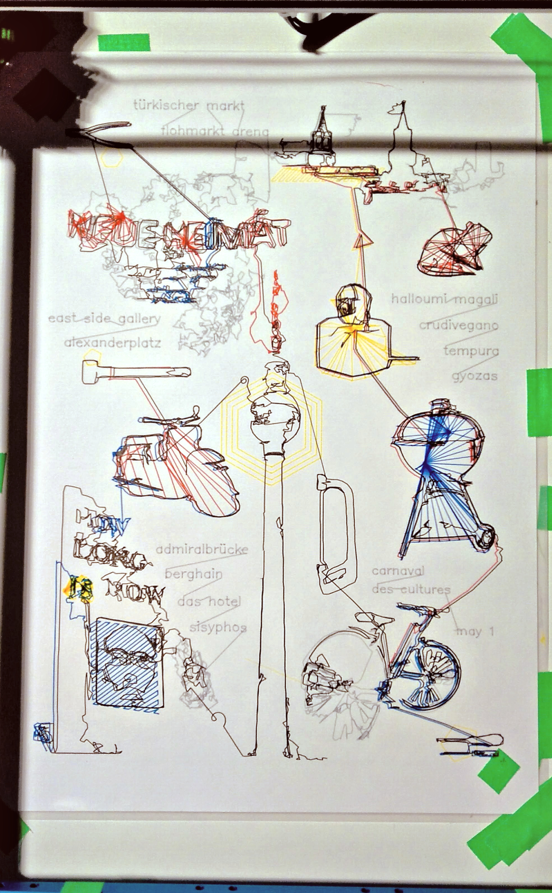
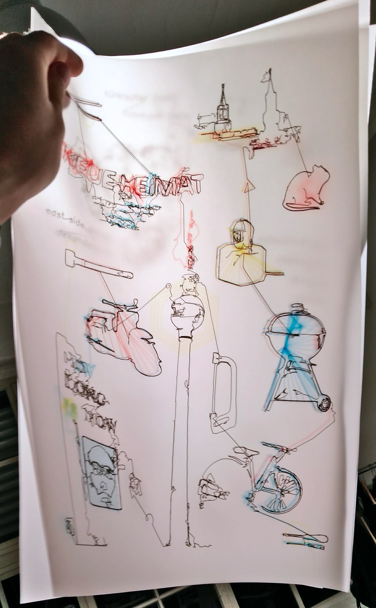
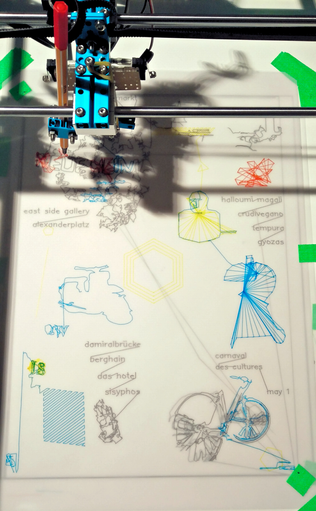
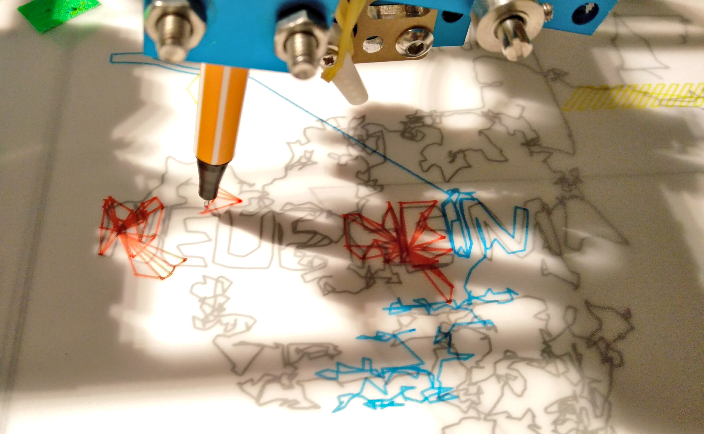
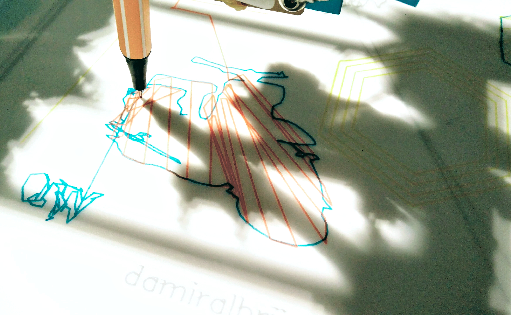
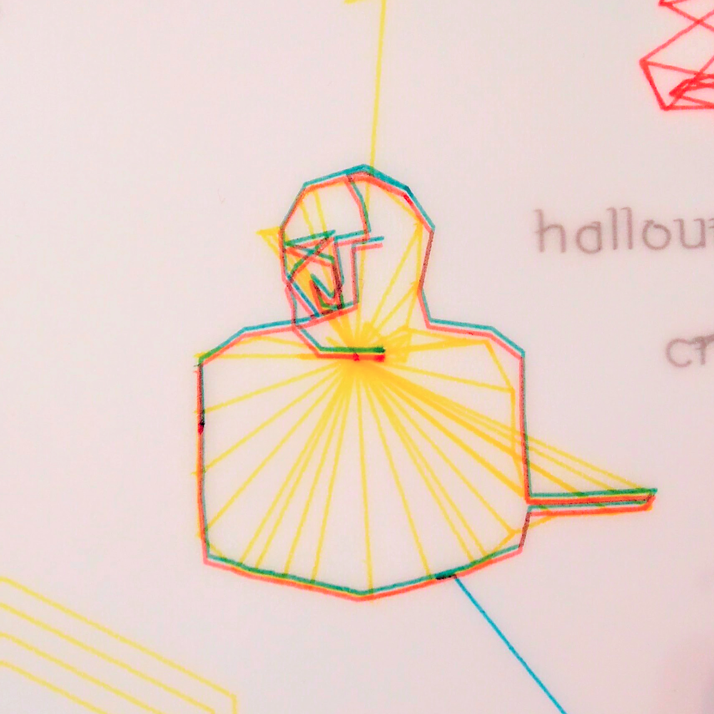
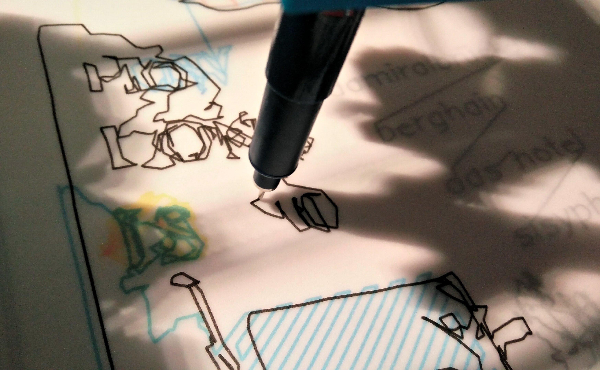

{:class="img-col-12"}{:class="img-col-6 img-clear"}{:class="img-col-6"}{:class="img-col-12"}{:class="img-col-4 img-clear"}{:class="img-col-4"}{:class="img-col-4"}{:class="img-col-6 img-clear"}{:class="img-col-6"}{:class="img-col-12"}

This plotter print collects a series of moments and memories that I lived with a friend in Berlin between 2015 and 2016.

It was made using photos and images of those memories and processing to generate different svg versions where the contour or infill was traced. Each color was printed on an individual translucent paper layer.

The tracing algorithm was self developed. The plotter was lent me by [@schwittlick](https://www.instagram.com/schwittlick/)
