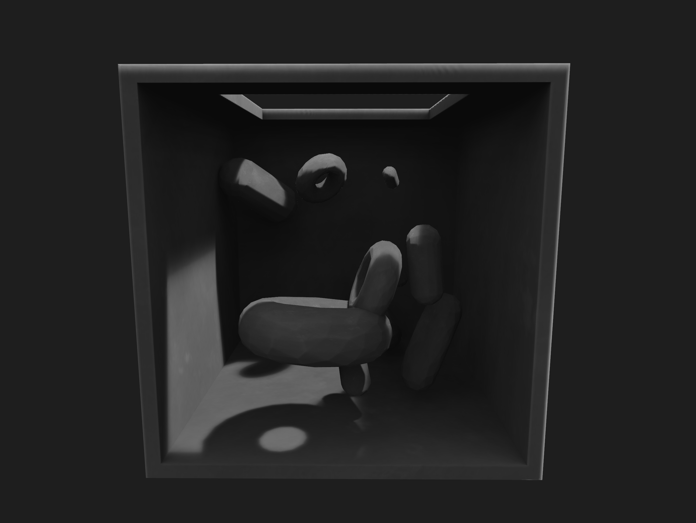
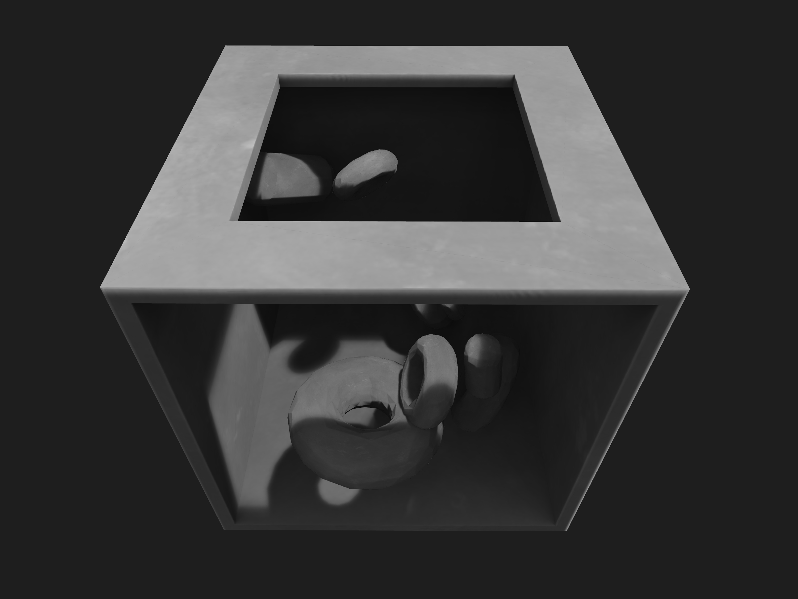
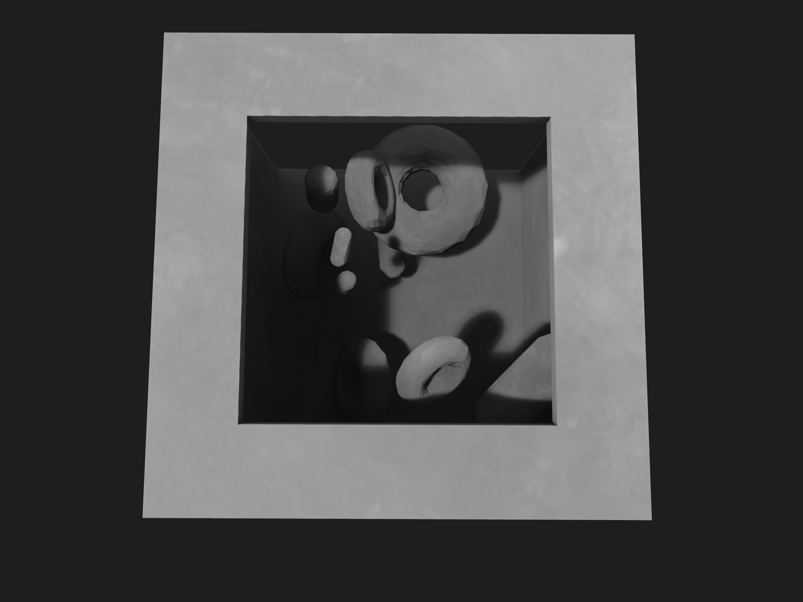
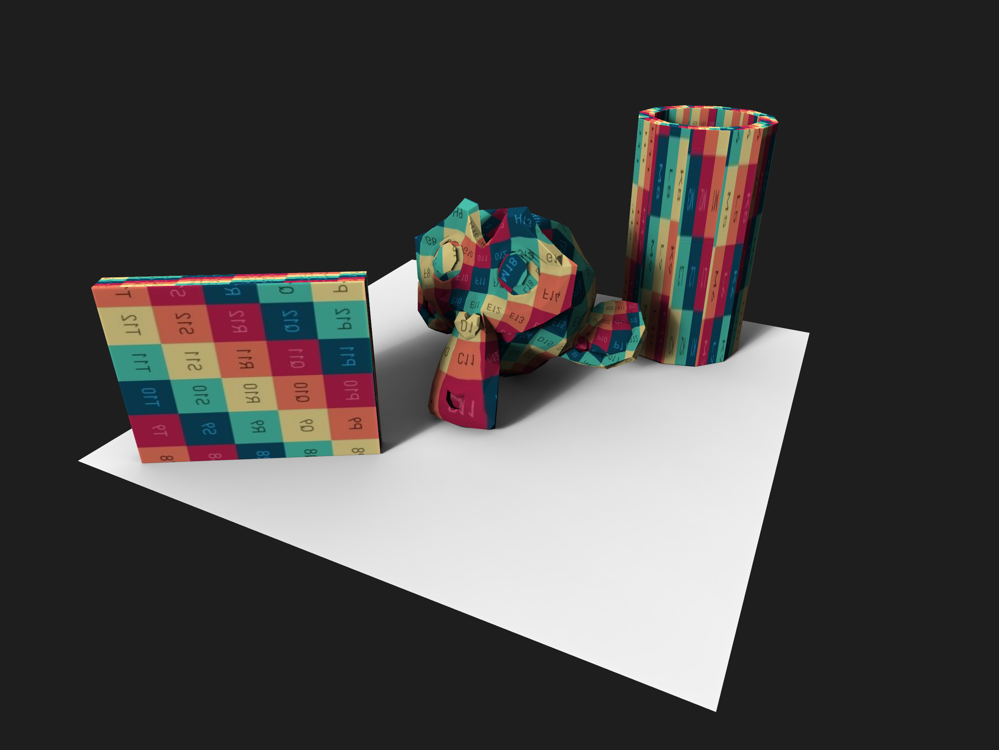
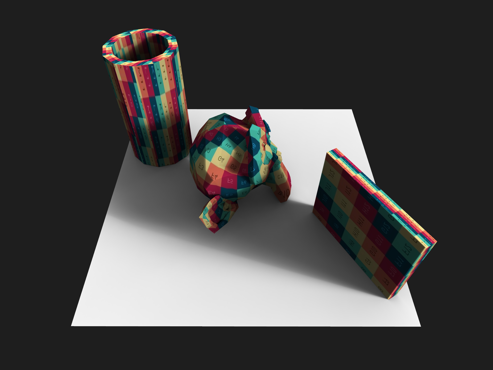
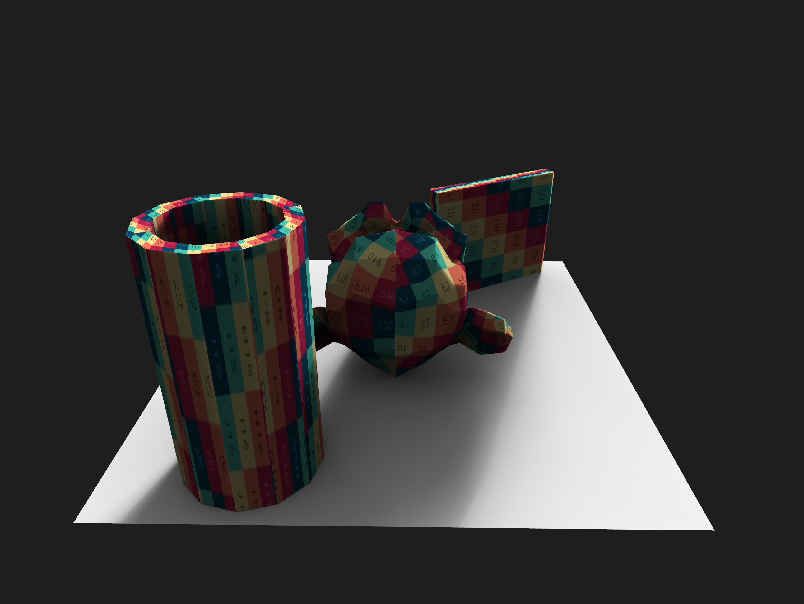

{:class="img-col-6"}{:class="img-col-6"}

A simple OpenGL ambient light baker for [openframeworks](https://openframeworks.cc/).

**ofxGPULightmapper** combines different techniques to generate fast and smooth ambient shadows and textures

The library allows generating a set the coordinates suitable for Light Mapping and handles separately the different UV spaces.

The custom control of light direction, can be utilized to generate *Ambient Occlusion* and *Light Bounces*. The library will manage internally the shadow map and biased matrix.

{:class="img-col-4"}{:class="img-col-4"}{:class="img-col-4"}

Open source at [ofxGPULightmapper](https://github.com/action-script/ofxGPULightmapper) on github.

[openFrameworks + GPU Lightmapper]
