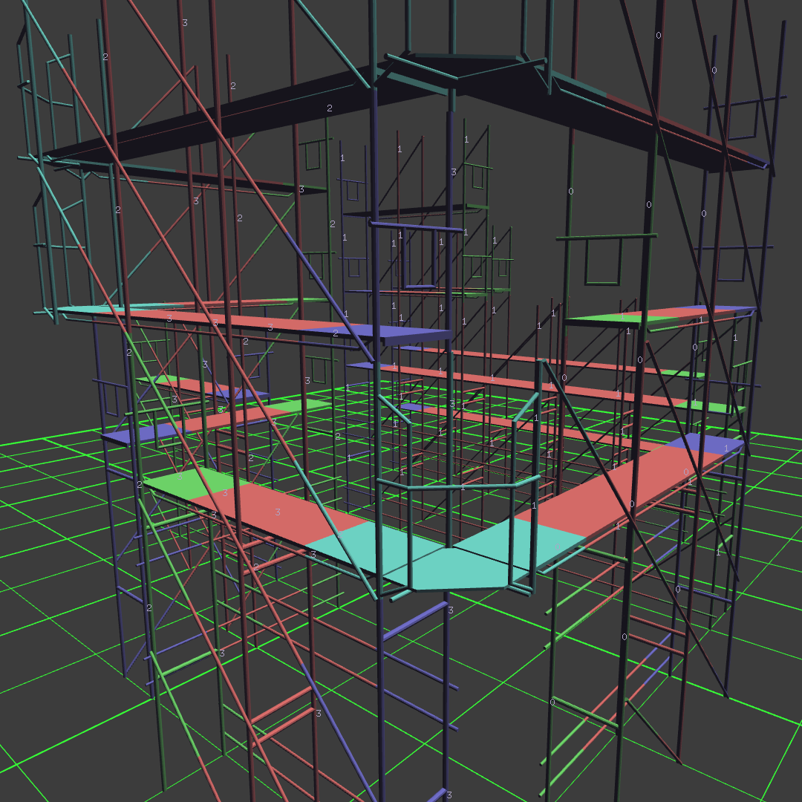
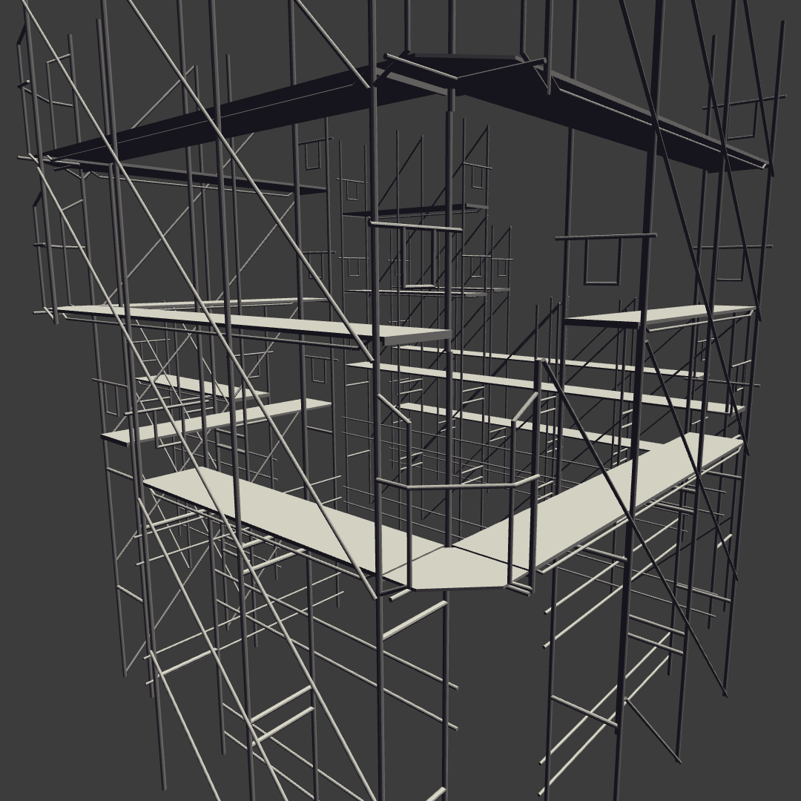

<video autoplay controls loop="loop">
   <source src="./assets/media/video/188723813746.mp4" type="video/mp4" />
</video>

{:class="img-col-6"}{:class="img-col-6"}

<video controls loop="loop">
   <source src="./assets/media/video/wfc_02.mp4" type="video/mp4" />
</video>

Realtime Generative structures using Wave Function Collapse. I created ofxWFC3D, an [openframeworks](https://openframeworks.cc/) addon implementing a 3D version of the WFC algorithm by Maxim Gumin including extra features and functionalities.

Wave Function Collapse implementation for #openframeworks.
ofxWFC3D is a 3D version of the WFC algorithm by [Maxim Gumin](https://twitter.com/ExUtumno), wrapped on an addon and ready to be used.

Open source at [ofxWFC3D](https://openframeworks.cc/) on github.

[openFrameworks + Wave Function Collapse]
