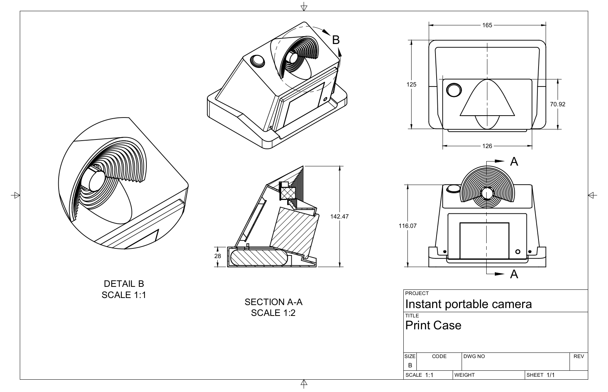
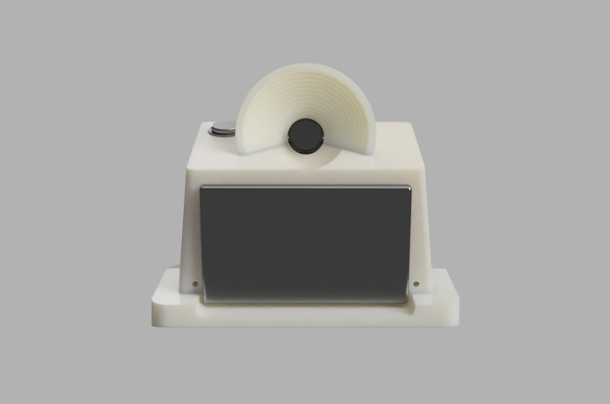
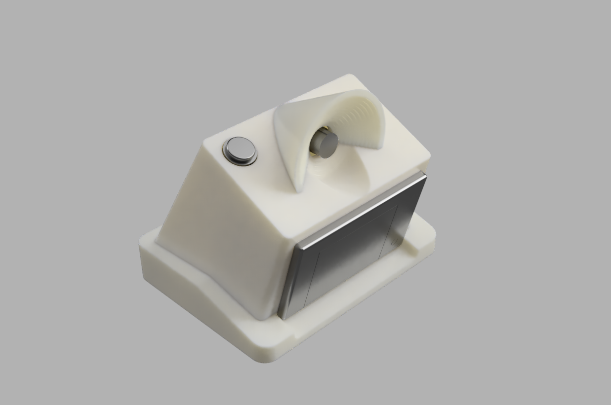

{:class="img-col-12"}{:class="img-col-12"}{:class="img-col-6 img-clear"}{:class="img-col-6"}

{:class="img-col-6"}{:class="img-col-6"}{:class="img-col-12"}

portable instant pi camera.
[instructables article](https://www.instructables.com/id/Portable-Instant-Pi-Camera/)

[raspberry pi zero w + thermal printer]