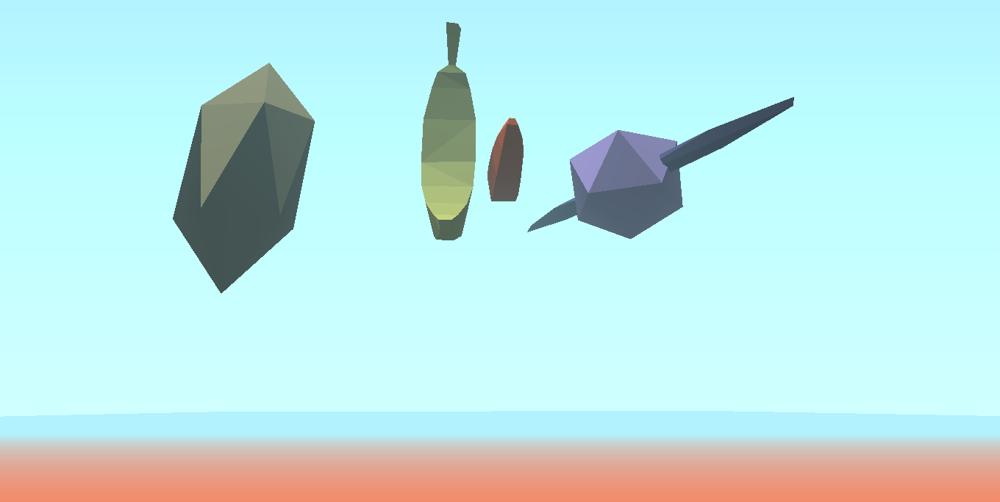

{:class="img-col-5"}{:class="img-col-5"}{:class="img-col-2"}{:class="img-col-12"}{:class="img-col-12"}{:class="img-col-6 img-clear"}
{:class="img-col-6"}{:class="img-col-6 img-clear"}{:class="img-col-6"}

minimal online WebGL engine and dynamic scene viewer.

features:
- raw webGL API manager
- scene and mesh JSON loader / manager
- basic scene render structure
- hierarchical transformation tree
- delegated resources loading
- shader load manager
- directional sun illumination
- linear fog
- depth based chromatic aberration
- pointer interface
- dynamic mesh / items selection

[sourcecode on githu](https://github.com/action-script/kosmo)

[nodejs + webgl + ES6]
