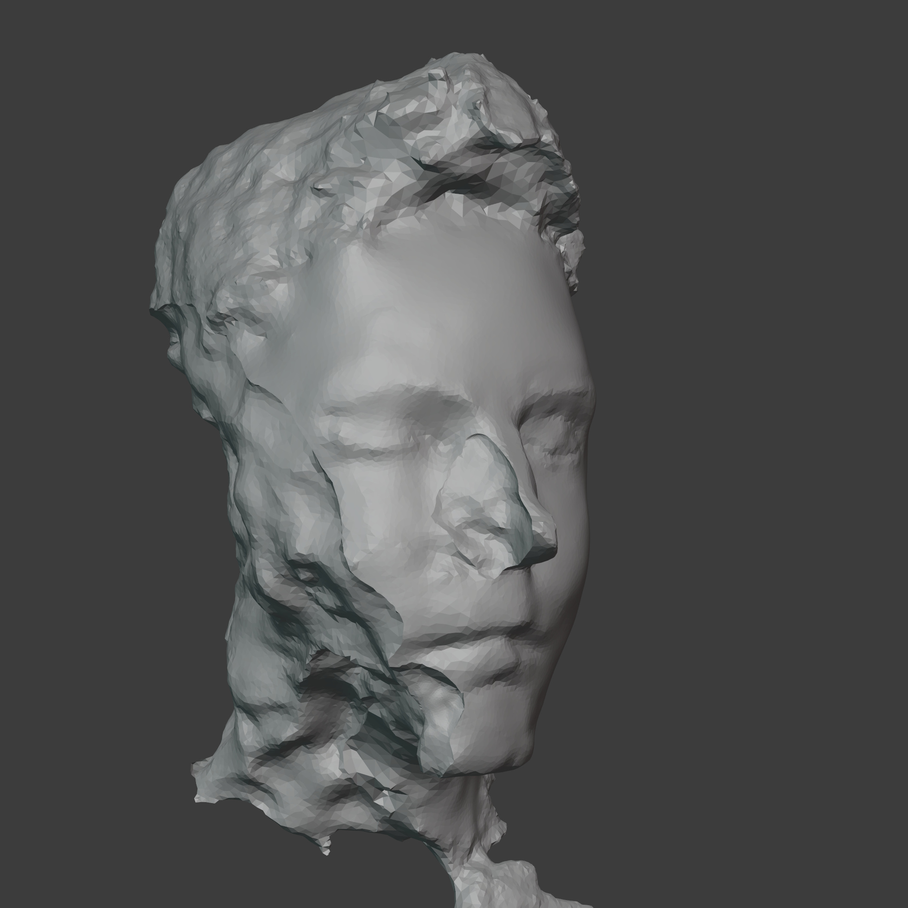

{:class="img-col-12"}

{:class="img-col-6"}{:class="img-col-6"}

{:class="img-col-6"}{:class="img-col-6"}

<video autoplay controls loop="loop">
   <source src="./assets/media/video/portrait_2020_web.webm" type="video/webm" />
</video>

A combination of photogrammetry and blender sculpting.

[blender + meshroom]
