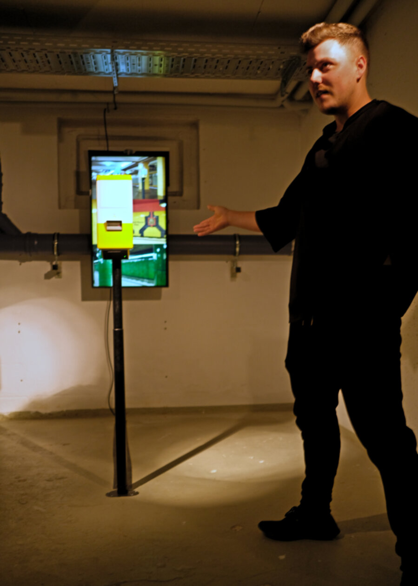

{:class="img-col-12"}

<iframe title="vimeo-player" src="https://player.vimeo.com/video/458506989" frameborder="0" allowfullscreen></iframe>

{:class="img-col-6"}{:class="img-col-6"}
{:class="img-col-12"}

{:class="img-col-12"}

{:class="img-col-6"}{:class="img-col-6"}

<video controls>
   <source src="./assets/media/video/BUUS-promo_02.mp4" type="video/mp4" />
</video>

{:class="img-col-4"}{:class="img-col-4"}{:class="img-col-4"}

Ephemeral, distorted and fading in time, experiences and memories are not tangible, yet they are one of our most precious possessions.
Your experiences make you who you are and the collective memories make Berlin the city it is today.

***Berlin, Under the Urban Skin*** makes a sectional cut in Berlin's lifestyle and subculture by bringing together stories, anecdotes and real experiences of diverse *BVG users.

As an icon of the city and a fundamental part of Berlin's culture, the BVG moves more than one million users every day. This enormous friction of human lives colliding in a small underground space sparks all kinds of experiences that citizens and visitors have witnessed in numerous ways.

*\* BVG Berliner Verkehrsbetriebe - Berlin Transport Company*

------

Berlin, Under the Urban Skin premiered at Eight Rooms Gallery exhibition 5#, together with other 7 fantastic artist.
