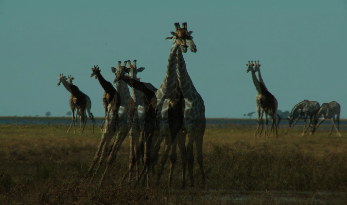
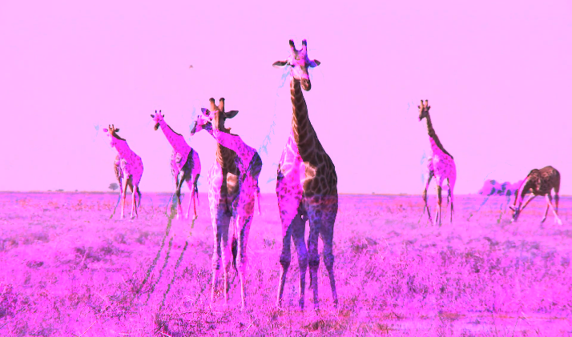
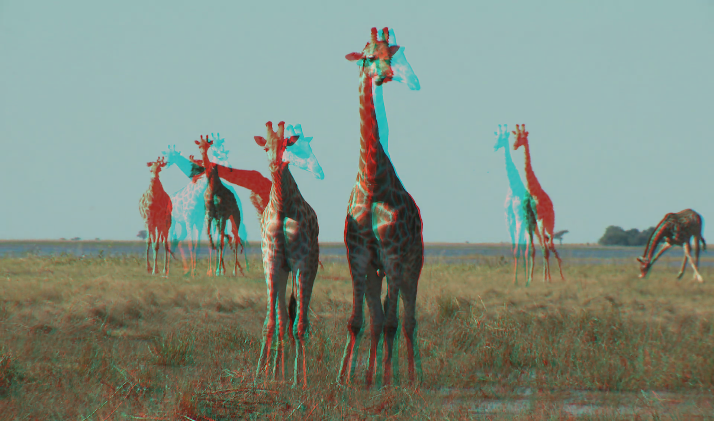

<video autoplay controls loop="loop">
   <source src="./assets/media/video/139544455105.mp4" type="video/mp4" />
</video>

-----

{:class="img-col-6"}{:class="img-col-6"}{:class="img-col-12"}

real time video effect by dividing the image into columns / rows and mixing the RGB channels with an ofset applied to each element.

[webgl + HTML5 video + glsl]